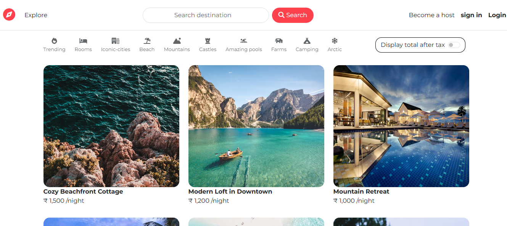
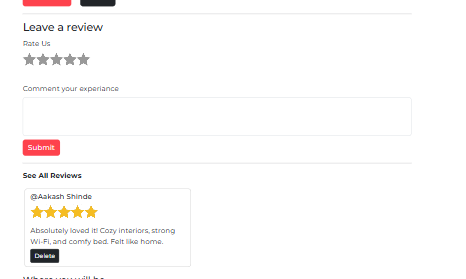
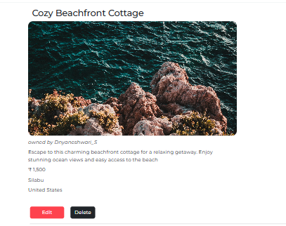

# 🏠 Rentora – A Mini Airbnb Clone

**Rentora** is a full-stack web application inspired by Airbnb, designed for listing and booking unique stays around the world. Built as a personal project to practice modern web development, backend integration, and the MVC architectural pattern.

## ✨ Features

- 🛏️ Create, edit, and delete property listings
- 📍 View listings with maps (Mapbox integration)
- 🔐 User authentication (Register, Login, Logout)
- 🖼️ Upload images for listings
- 💬 Leave reviews and ratings
- 🌐 Google OAuth login
- 📱 Responsive design for all devices

## 🚀 Tech Stack

- **Frontend**: HTML, CSS, JavaScript, Bootstrap
- **Backend**: Node.js, Express.js
- **Database**: MongoDB (Atlas)
- **Templating Engine**: EJS with ejs-mate
- **Other**: Cloudinary (image hosting), Multer (upload middleware), Mapbox, Passport.js
- **Architecture**: MVC (Model-View-Controller)

## 📸 Screenshots

### 🖼️ Login & Signup Page


### 🏠 Homepage


### 📝 Review Section


### 📄 Listing Details Page


## 🔧 Installation

```bash
git clone https://github.com/dnyanu-5/Rentora
cd Rentora
npm install
npm start
